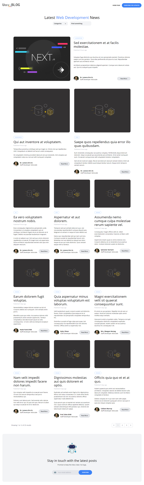
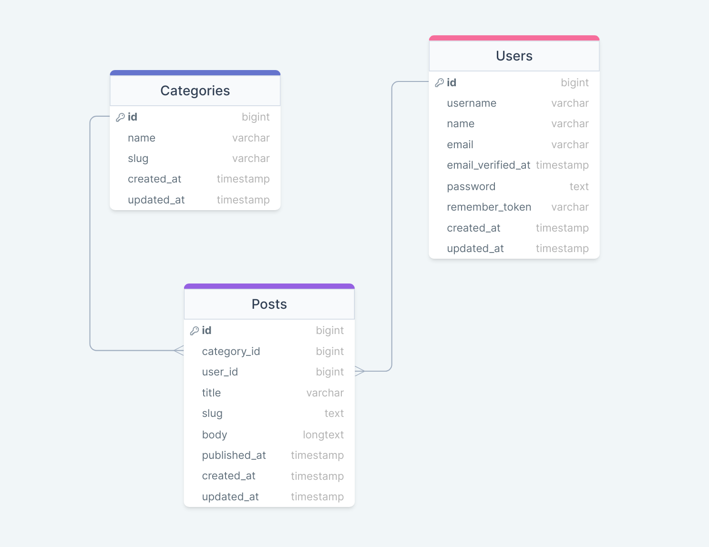

<p align="center" styles="margin: 10px 0">

</p>


## About UdevBlog

Introducing our newest project - a dynamic web platform built on Laravel that lets authors share their expertise on web development and programming through engaging blog posts.

<p align="center" styles="margin: 10px 0">
<table>
    <tr>
        <td>Name</td>
        <td style="font-weight: bold">UdevBlog</td>
    </tr>
    <tr>
        <td>Backend</td>
        <td style="font-weight: bold">Laravel</td>
    </tr>
    <tr>
        <td>Database</td>
        <td style="font-weight: bold">MySQL</td>
    </tr>
    <tr>
        <td>Frontend</td>
        <td style="font-weight: bold">TailwindCSS</td>
    </tr>
    <tr>
        <td>State</td>
        <td style="font-weight: bold;color:red">In Development</td>
    </tr>
    <tr>
        <td>URL</td>
        <td style="font-weight: bold;color:blueviolet">not yet</td>
    </tr>
</table>
</p>


<p align="center" styles="margin: 10px 0">

</p>

## Database Design

```properties
    Entities: Users, Posts and Categories
```

<p align="center" styles="margin: 10px 0">

</p>


